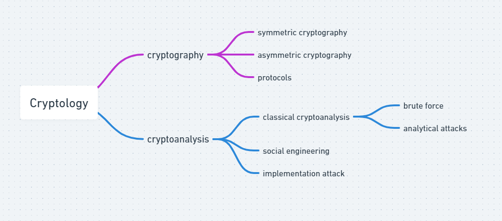
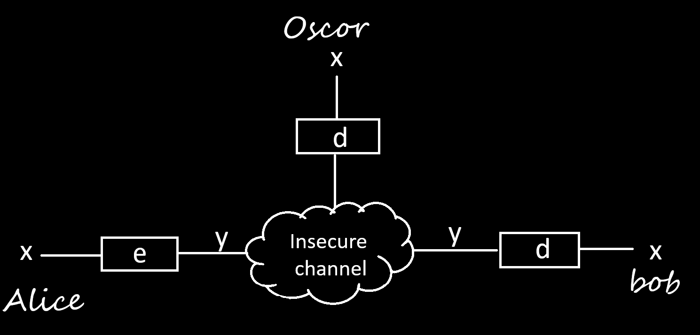
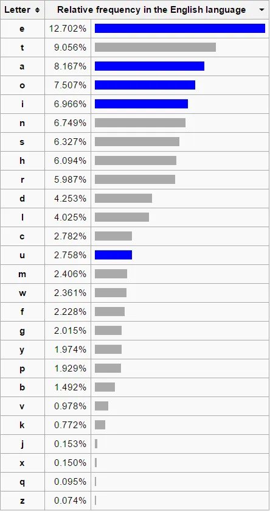

# Lecture 1 (Introduction to Cryptography)

Refrences - https://www.youtube.com/watch?v=2aHkqB2-46k&t

**what we are going to study in this chapter**
```
classicfication
basics/setup
subsitution cipher
attacks
```
## Classicfication
 modern application of Cryptography
  - gnu pg
  - secureshell
  - (plug-in) for thunderbird
  - s-MIME email encryption
  - cell phone
  - hdcp -multimedia protocol
  - bank cards
  - VPN
  - E-passport
  - online- banking
  - Ipod
  - kindle



## Basics

- channel example - Internet , airwaves , Gsm , Wifi

```
+-------------+---------------------+
| SHORT FROMS |       MEANING       |
+-------------+---------------------+
|      x      |      plain text     |
+-------------+---------------------+
|      y      |     cipher text     |
+-------------+---------------------+
|      e      | encryption function |
+-------------+---------------------+
|      d      | decryption function |
+-------------+---------------------+
|      k      |         key         |
+-------------+---------------------+
|     |k|     |      key space      |
+-------------+---------------------+
```

### Kerchoffs principle [1883]

A crypto system should be secured even if the attacker(Oscor) knows all the details about the system with the exception of the secret key.

## Subsitution Cipher
 - historical cipher
 - operates on letters
 - **Idea** - Replace every plaintext letter by a fixed ciphertext letter

 - **example**  - A -> l , B-> d , C -> w , and so on
 ```
 e(ABBA) -> lddl
 ```
### Is this cipher secure ?
NO
## How can we Attack the cipher ?

### Brute Force/Exhaustive key search

```
26 * 25 * 24 ... * 1 = 26!
```

key space is too large

### frequency analysis
we will guess which letter is which 

