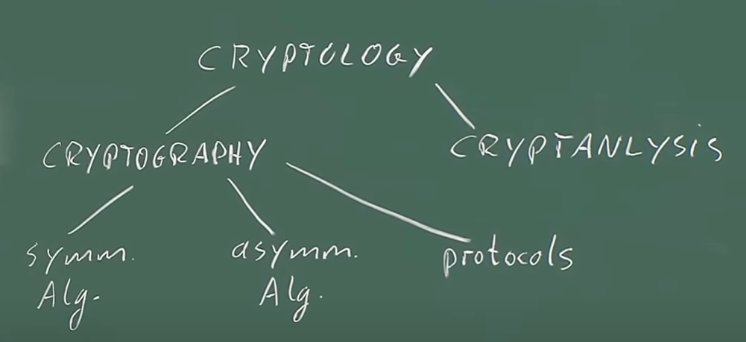
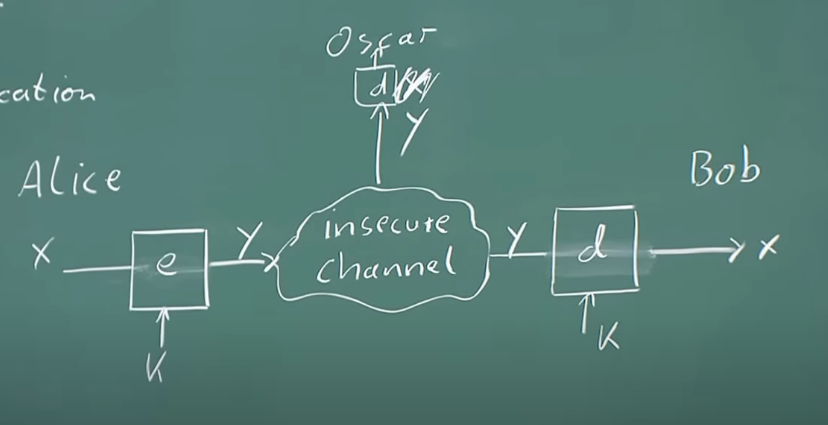
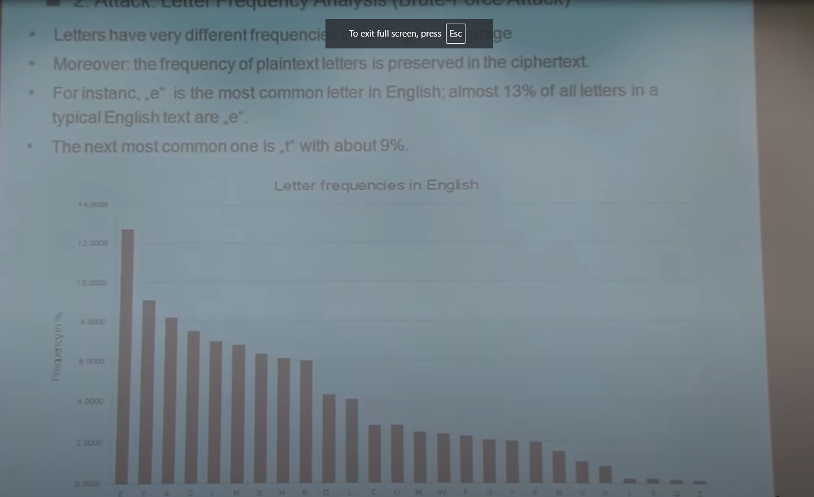
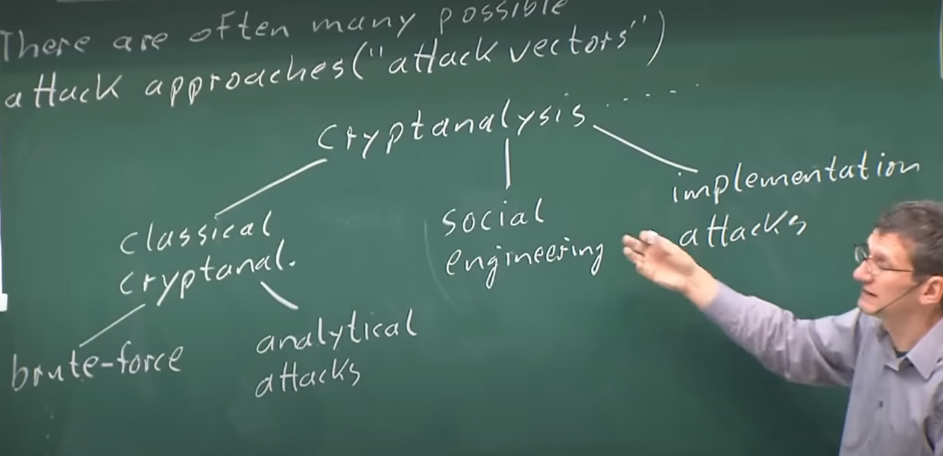
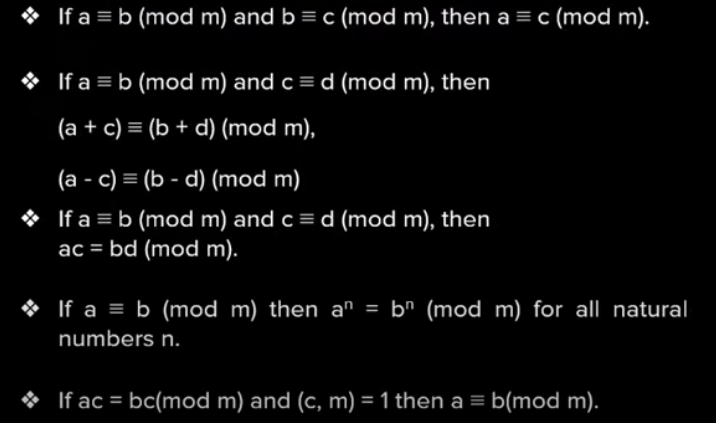

# Lecture 1 (Introduction to Cryptography)

Refrences - https://www.youtube.com/watch?v=2aHkqB2-46k&t



Crytpanalysis is more towards hacker point of view.

## Can you make your own Cryptographic function?
if we have to make our own cryptographic function , no matter how many matrix , trignomentery or logic we should use , there is a 99% chance that what we make is pretty hackable.

### So how people make cryptographic function?
they just make it , and prays that nobody is able to hack it , if it is unhackable for about 5-10 years then it is geral assumption that it is unhackable.
........So basically we are just hitting a blank in a sky .



## Notation
<li>X = PlainText</li>
<li>Y = cipherText</li>
<li>E = encrytion</li>
<li>D =  decrytion</li>
<li>k = Key</li>
<li>|k| = Key set</li>


## kirchhoff principle cryptography

A good cryptographic system should remain secure even if the algorithm used is known.


## Subsitution cipher 

- old and stupid cipher ......jo 100 saal se chle jaa rhe 
- basically they operates on plain text letter

example -
```
A ko d bna do
B -> l
C -> k
```


### Is this Secure ??
no..

### Can we attack the cipher ?

#### Brute force .
- total 26 letter
- if one letter is using k for C.....26 remnong are 25 .....
- so 26! is the answer 
-- it is still the big answer


#### Letter frequecy annalysis




basically we find which letter in encryted text is most and then try to match it with usually highest alabhaptes in english

## types of attacks in cytoanalysis



# LECTURE -2 ( Modular Arithmetic)

must watch
https://www.youtube.com/live/FAmvFm8ELgY?si=UUwUAMZ3TBPim1Fv

ginti 1 se leke infinity tak jaati hai ....aur jab hum bolte hein bohot natural si lagti hai 

1,2,,3,,4,.........

but koi humse time puchta hai to 500 ghante nhi bolte hum ya to 24 ghante wala ya 12 ghante wala timing bolte hein .

aur ye timing sochne mein humnein time nhi lagta 

basically wahi chiz hai modular Airthmetic in real life

few properties which are very impotarnt 



https://www.youtube.com/watch?v=W1SY6qKZrUk&list=PL2jrku-ebl3H50FiEPr4erSJiJHURM9BX&index=2


